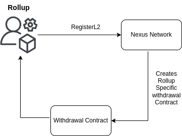
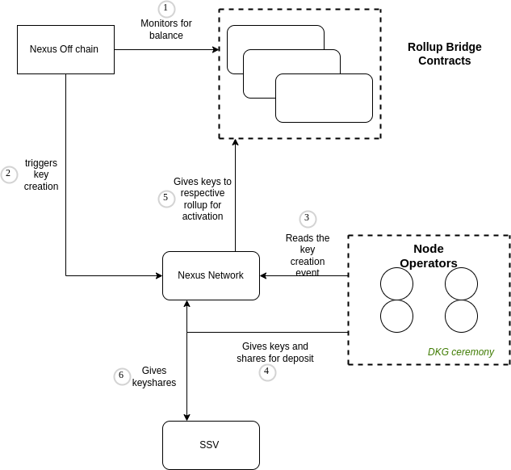
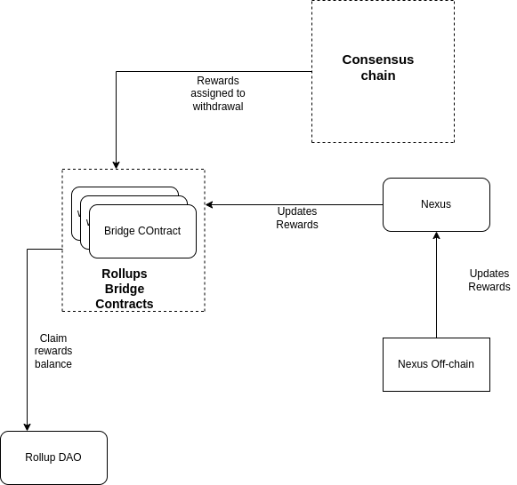
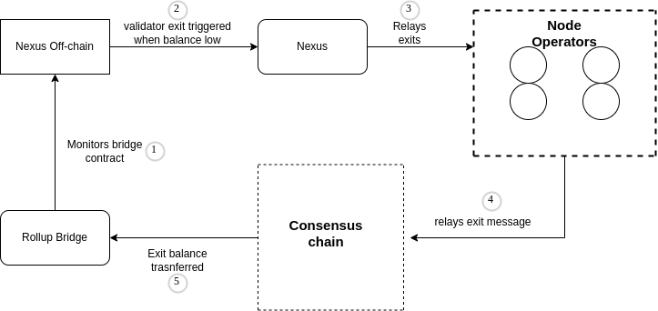
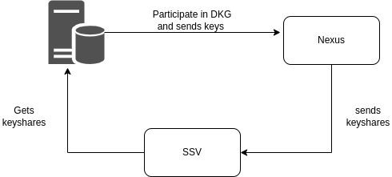

---
layout:
  title:
    visible: true
  description:
    visible: false
  tableOfContents:
    visible: true
  outline:
    visible: true
  pagination:
    visible: true
---

# 🏹 Nexus Network Design Document

### Purpose

The purpose of this doc is to give a high-level overview of the system architecture and workings of different components. This acts as a guide for developers/enthusiasts to deep dive into the protocol design. This will also help other open-source contributors to understand how Nexus Network is going to tackle the problem faced by rollups.

### Scope

The scope of this document covers the following elements:

1. **User Flows**: This includes all the data flows in Nexus Network design
2. **Contracts:** A brief explanation of all the contracts that will be used by Nexus Network
3. **Off-chain bots:** Off-chain bots will be used to track and perform certain actions needed by the protocol to trigger smart contract execution

## User Flows:

### Registration Flow:

<figure><figcaption></figcaption></figure>

Onboarding on a new rollup involves a three-step process -

1. **Changes in the rollup bridge contract** - Rollup makes a few changes in the bridge contract that enable the transfer of ETH locked in the rollup to the validator deposit contract. The rollup also enables a few functions -

* _depositValidator()_ - The function is called to transfer ETH to a validator that is being activated for the rollup. Only Nexus Network contracts can call this function
* _updateRewards()_ - This function call updates the rewards earned by validators activated by the rollups and is allowed only to Nexus Network contracts
* _redeemRewards() -_ This function is used by the rollup admin to claim the rewards earned by validators activated by the rollups

```solidity
address constant DepositContract = <ETHEREUM_DEPOSIT_CONTRACT>
address public constant DAO = <ROLLUP_DAO_CONTRACT>
address public NEXUS_NETWORK = <NEXUS_CONTRACT_ADDRESS>
uint256 constant VALIDATOR_DEPOSIT = 32 ether
Rewards public stakingReturns
function depositValidator(INexusInterface.Validator[] calldata _validators,uint256 stakingLimit,uint256 validatorCount) onlyNexus
function updateRewards(uint256 amount,bool slashed,uint256 validatorCount) onlyNexus
function redeemRewards() onlyDAO
```

2. **Whitelist rollup address:** The whitelisting process ensures that a rollup registers with Nexus Network only using an admin address decided by the rollup team. This also creates a one-to-one mapping between rollup and rollup admin address. The whitelisting is done by the Nexus Network team

```solidity
function whitelistRollup(string calldata name, address rollupAddress) onlyOwner
```

3. **Register rollup:** Once the rollup bridge contract is set up and the rollup admin address is whitelisted, the admin address needs to call a _registerRollup()_ function to start talking to the Nexus Network contracts. Once the rollup makes the transaction, a mapping for the rollup is created and stored with the Nexus Network. The mapping contains all the necessary information about the rollup including the address of the bridge contract, cluster to which ETH is staked, staking limit, etc

```solidity
struct Rollup{
	address bridgeContract;
	unit16 stakingLimit;
	unit64 validatorCount;
	uint32 operatorCluster;
}
mapping(address=>Rollup) public rollups;
mapping(uint32=>uint32[]) public operatorClusters;

function registerRollup(address bridgeContract,uint32 operatorCluster,uint16 stakingLimit) external 
```

### Validator Flow:

<figure><figcaption></figcaption></figure>

Once a rollup has registered with Nexus Network, it sets a staking limit determining the maximum amount of ETH from the rollup that can get staked. Nexus Network runs an off-chain bot that examines the amount of ETH in the rollup bridge contract. It triggers a key creation event to the Nexus Network contracts if there are 32 ETH or more available to be staked based on the limit defined by the rollup. The following steps are involved in the validator creation flow once the key generation is triggered -

1. Nexus Network has a monitoring system that tracks the performance of validator clusters and accordingly allocates the incoming ETH to a cluster. Nexus contracts generate a validator key creation event and share it with the selected node operator cluster
2. Once the cluster reads the key creation event, it performs a Decentralised Key Generation (DKG) ceremony to generate a private key in a distributed manner
3. The key shares generated are sent to the Nexus contracts. Nexus contracts send the keyshares to the SSV network for activation after which they are distributed among the node operators who are a part of the cluster
4. The public key of the validator generated during the DKG event is shared with the Nexus Network contracts which calls the rollup to activate the validator by transferring 32 ETH to the validator
5. Once the ETH is transferred, the validator starts performing staking operations with the support of the node operators in the cluster

### Rewards Flow:

<figure><figcaption></figcaption></figure>

Rollup has multiple options for rewards. Currently, the bridge contract is set as the withdrawal address and it receives all the staking rewards.

Nexus Network will run an off-chain bot that will periodically update the rewards in the bridge contract which can be claimed by the DAO contract whenever they want.

The staking rewards are divided into two parts -

* Rollup DAO gets 90% of the staking rewards.
* Nexus Network gets 10% of the staking rewards as revenue. Nexus Network will cover the node operator fee, SSV network fee, and operational cost from this and the rest will be profit for Nexus Network

### Validator Exit Flow:

<figure><figcaption></figcaption></figure>

Validator exits can be triggered on Nexus Network in two ways -

1. Voluntary exits: These are exits triggered by the rollup DAO to reduce the amount of ETH staked through Nexus Network
2. Involuntary exits: Involuntary validator exits are triggered by Nexus off-chain bots that continuously monitor the bridge contract address. This happens if the maximum staking limit for the rollup is triggered because of changes in the amount of ETH bridged to the rollup

In both of the above cases, once the withdrawals are triggered, the Nexus contracts determine the number of validators to exit and use the node operator scoring mechanism to determine which validators must be exited. The details are then transferred to the node operators to exit the validator.

Once the validator exit is confirmed by the node operators, the off-chain bots notify the Nexus contracts about the validators, and the subgraph is updated accordingly.

Nexus Network runs an off-chain bot that checks for the receipt of funds from validator exits. Once the validator exit is complete and funds are received in the bridge contract from the consensus chain, the off-chain bot updates the details in the Nexus contracts.

### Operator Flow:

Node operators perform two critical tasks for Nexus Network -

1. They participate in the DKG ceremony to generate keyshares for the validators in a decentralized way
2. They help in running validators

**Operator registration**

* Any node operator registered with the SSV network can register on Nexus using its Operator Id
* The node operators must put up some security collateral on Nexus Network to participate in the validation process. The exact mechanism for the security collateral is under design

**Operator key generation**

<div>


 

<figure><figcaption></figcaption></figure>

</div>

* Operators participate in the DKG ceremony for validator keyshares creation&#x20;
* Nexus Network submits the keyshares to the SSV network which distributes them to the operators

**Operator performance**

* Nexus Network team will create a node operator performance dashboard to publicly track the performance of participating operators
* Each node operator will get an operator score that determines the number of keyshares allocated to the node operator

### Monitoring and Alerting

Nexus Network will place the right monitoring and alerting checks in place to ensure continuous monitoring with public transparency

The components crucial for the product are:

1.  **Contracts:** All the events that are emitted should be caught and stored in a well-structured way. For this, Nexus Network is using an indexer and graph to analyze the events. Resources to be used are [The graph](https://thegraph.com/en/), [Subsquid](https://subsquid.io/), [Zettablock](https://www.zettablock.com/)

    Nexus Network will also set up scripts that will monitor all the transactions and raise an alert whenever they encounter a malicious or an out-of-bounds event. The guiding rules for setting the limits to be monitored will be figured out over time with the launch of testnet
2. **Off-chain bots:** Initially the bot operation will be centralized and over time Nexus Network will look for more decentralized solutions. At the start, proper alerting channels like Telegram, slack, and email notifications will be set up. As the technology matures and becomes more stable, Nexus Network will run the bots through zk-proofs or an optimistic system to make it more decentralized with easy metrics exporting and dashboarding features.
3. **Node Operator/ Validator:** Node operators are the backbone of any staking provider. Nexus Network will ensure that proper dashboards and alerting mechanisms are in place to handle any slashing events or catch them in the early stages to prevent them altogether
